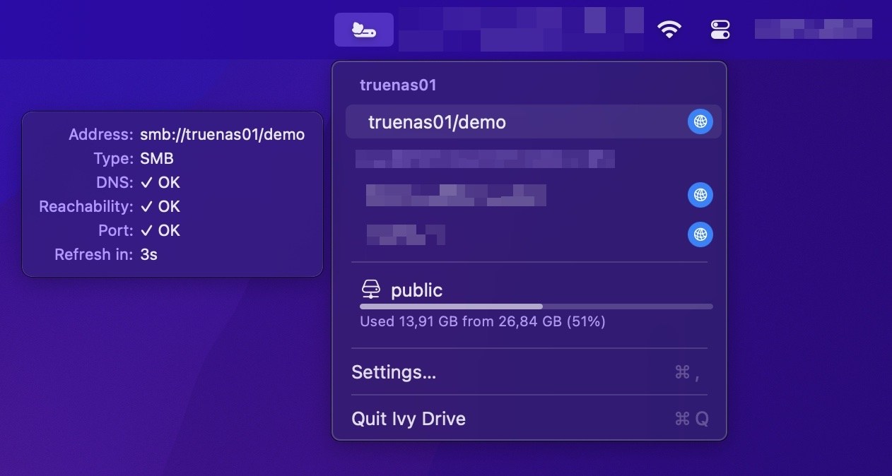

  

<h1 align="center">Ivy Drive</h1>

Keep track of your network shares on macOS and reconnect them with one click.

Ivy Drive remembers your network shares (SMB, NFS, FTP, AFP, or any server address macOS can connect to), shows at a glance which ones are connected and which servers are reachable, and brings them back automatically when you start your Mac or switch networks.

## Quick start

1. Download the latest `.dmg` from [Releases](https://github.com/hbrennhaeuser/ivydrive/releases/latest).
2. Open it and drag **IvyDrive** to **Applications**.
3. Start Ivy Drive from Applications. Its icon appears in the menu bar.

Builds are not notarized, so macOS blocks the first launch. See [First launch](docs/user/installation.md#first-launch) for how to allow it.

## Features

- One-click connect for every saved network share, or all shares of a host at once
- One-click open of connected network shares in Finder
- Automatic connect on startup and when the network changes, without Finder windows or password prompts
- Availability checks (DNS, network, port), so you see whether a share is reachable before connecting
- Capacity and usage for connected network shares and local volumes
- Notifications for automatic connects and ejects
- Always available from the menu bar, with launch at login

Requires an Apple Silicon Mac with macOS 14 or later.

## Documentation

- [Installation](docs/user/installation.md): install, update and uninstall
- [Usage](docs/user/usage.md): status colors, automatic connects and passwords
- [Building from source](docs/dev/building.md)

## License

GPL-3.0-only. See [LICENSE](LICENSE).
